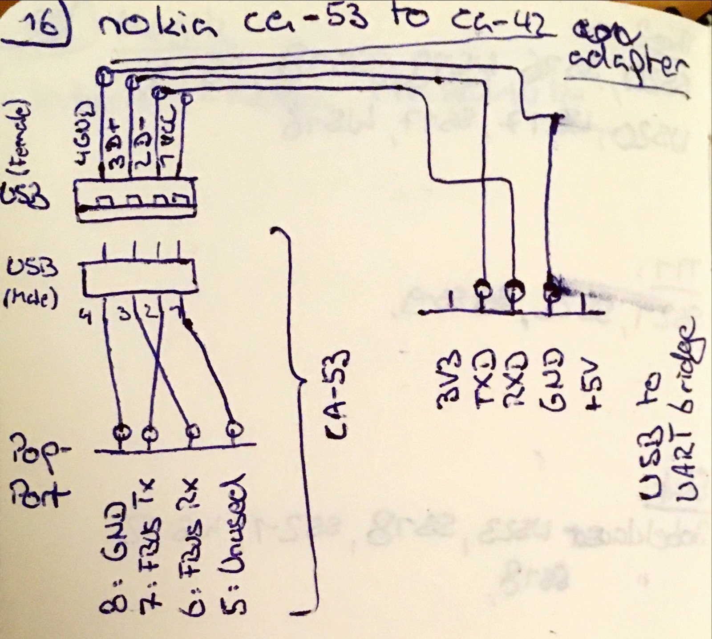

This is somewhat a mess. Most phones have the Pop-Port connector, but some phones do support usb natively and other do not.
Those phones need a data cable with a builtin serial to usb converter, like the ca-42 or the older dku-5.
For an overview, see [this archived page](https://web.archive.org/web/20201201024621/https://hardwarebook.info/Pop-Port).

## ca-53 to ca-42

If you messed up like me and bought a ca-53, but you have a phone that only supports serial communication,
you can build a ca-42 cable using the ca-53, a female usb port, some jumper wires and an usb to serial converter.

This only works using gammu and not with the nokia pc suite.

## fake ca-42 cable

If you got a non-nokia ca-42 cable (sold on ebay as original nokia) with the usb id `10b5:ac70`.
This is a third party cable which was sold on [ca-42.com](https://web.archive.org/web/20060319073937/http://www.ca-42.com/).
Using gammu on linux, this worked out of the box.  
But it was a little harder on windows 7 and the nokia pc suite.
Unfortunately, archive.org did not contain the ca-42.com driver. Windows did not detect a driver automatically.
I tried forcing windows 7 to use the nokia ca-42 driver, but this resulted in windows freezing when the cable was plugged in.
I got it working by: 

* download the [cp201x driver](https://www.silabs.com/developers/usb-to-uart-bridge-vcp-drivers?tab=downloads) and install it.
* open device manager and right click on ca-42
* open "update driver software"
* open "browse my computer for driver software"
* open "let me pick from a list of drivers"
* select the cp201x driver

Now open the pc manager, configure it to use the right com port and the connection should work :)
